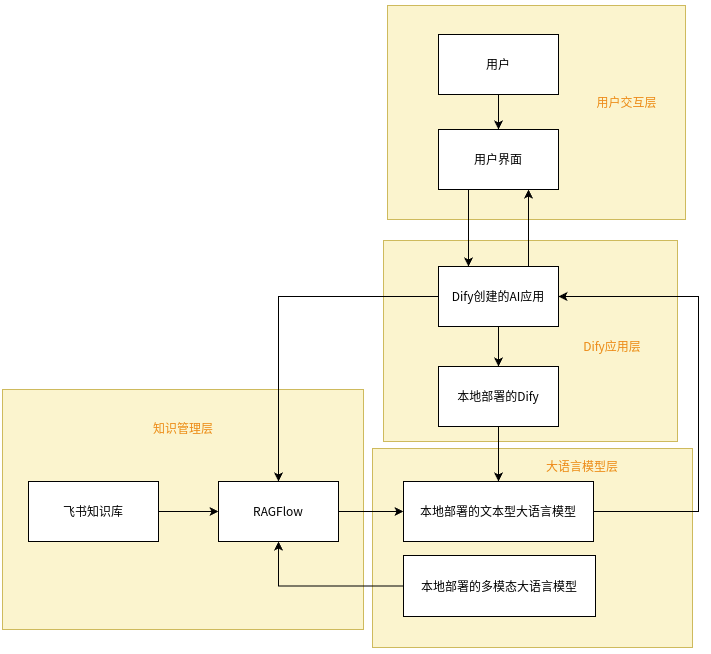

# 视光AI平台
## 简介
视光AI平台是一款基于本地化部署的智能应用系统，深度融合大语言模型与企业内部知识资源，旨在为企业员工打造高效、安全、智能的知识交互平台。

平台在本地服务器部署大语言模型，作为核心智能引擎，提供强大的自然语言处理能力；通过本地部署的 Dify 创建定制化 AI 应用，贴合企业业务场景需求；以飞书知识库作为知识源，经 RAGFlow 系统完成知识同步、索引与检索，实现知识高效管理。用户通过平台与 AI 对话时，系统能快速从知识库中检索相关信息，结合大语言模型能力，给出精准回答。

相比依赖外部云端的系统，本平台实现数据本地存储，保障数据安全；打破企业知识壁垒，让员工轻松获取所需知识，提升知识利用效率；还能基于不同业务需求定制服务，满足多样化场景。无论是加速业务决策，还是提升员工工作效率，视光AI平台都能为企业发展提供有力支持。

## 使用

### 前置准备
#### 飞书
本平台使用飞书知识库作为知识源，所以要有飞书知识库的权限，方法是去飞书的[开发者后台](https://open.feishu.cn/app?lang=zh-CN)创建应用并获取知识库相关的权限，然后将应用的appId和appSecret添加到平台设置中。

#### dify
dify是平台AI应用的提供者，根据自己的需求创建应用，并嵌入平台页面

#### ragflow
ragflow提供RAG，飞书的知识库文档全部会被同步至ragflow进行解析分块

#### ollama or vllm
ollama或者vllm用来部署大模型，部署的大模型接入dify，提供自然语言处理与知识交互能力

#### redis
用于做一些缓存，提升接口访问速度

### 运行
使用maven将代码打包成xxx.jar，使用`java -jar xxx.jar`命令启动即可在浏览器打开平台页面